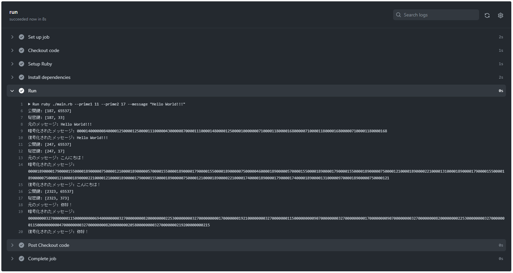

# my-simple-rsa.rb

🦣🦣🦣 RSA暗号をRubyで実装してみた！  

  

## 実行方法

```shell
ruby ./main.rb --prime1 素数A --prime2 素数B --message "メッセージ"
ruby ./main.rb --prime1 11 --prime2 17 --message "Hello World!!!"
```

## 情報イロイロ

転職先の企業でRubyを使用するため、学習として、、、  

---

書きコマンドでプロジェクトを初期化。  

```shell
gem install bundler
bundle init
```

必要なgemをインストール。  

```shell
bundle add rspec
```

---

テストツール(RSpec)の初期化。  

```shell
rspec --init
```
